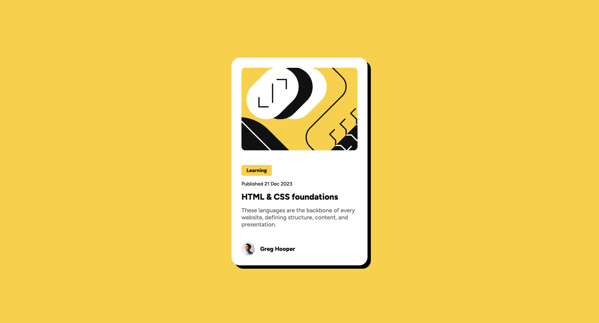

# Frontend Mentor - Blog preview card solution

This is a solution to the [Blog preview card challenge on Frontend Mentor](https://www.frontendmentor.io/challenges/blog-preview-card-ckPaj01IcS). Frontend Mentor challenges help you improve your coding skills by building realistic projects.

## Table of contents

- [Overview](#overview)
  - [The challenge](#the-challenge)
  - [Screenshot](#screenshot)
  - [Links](#links)
- [My process](#my-process)
  - [Built with](#built-with)
  - [What I learned](#what-i-learned)
  - [Continued development](#continued-development)
  - [Useful resources](#useful-resources)
- [Author](#author)

## Overview

### The challenge

Users should be able to:

- See hover and focus states for all interactive elements on the page

### Screenshot

### Links

- Solution URL: [GitHub repository](https://github.com/raulgaliciab/blog-preview-card)
- Live Site URL: [Live](https://raulgaliciab.github.io/blog-preview-card/)

## My process

### Built with

- Semantic HTML5 markup
- CSS custom properties
- CSS Pseudo-classes (hover)
- Flexbox
- Mobile-first workflow
- BEM

### What I learned

This is my second project from Frontend Mentor, and despite been similar to the first one I felt a great progress in the time I spent on it and the code quality.

In this project I used BEM methodology and the flexbox properties, allowing me to have a better control over how the tags behaved. Also, The CSS properties had a more structured order. Following this criteria:

1. Positioning
2. Box model
3. Typography
4. Visuals
5. Others

### Continued development

I still need to focus on a better git flow of commits with larger projects; and the responsive design implementation.

### Useful resources

- [MDN Web Docs](https://developer.mozilla.org/es/) - Reading the documentation for CSS properties behavior

## Author

- Raúl Galicia
- Frontend Mentor - [@yourusername](https://www.frontendmentor.io/profile/raulgaliciab)
